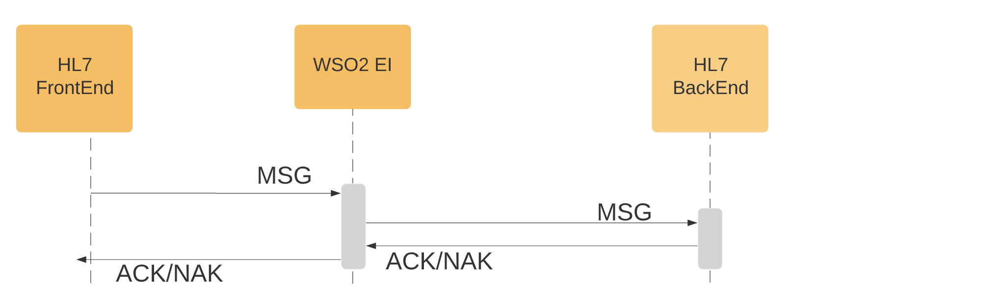

# Passthrough HL7 messages over MLLP protocol using a proxy service

This samples demonstrates passthrough HL7 messages over MLLP protocol and implemented as proxy service on WSO2 Micro Integrator 7.0. 

## Prerequisites

* Build and run the sample backends and integration flows as described  [here.](https://github.com/sagara-gunathunga/hl7-wso2-integration-samples/blob/master/README.md#how-to-build)

## How to Test

* Start HAPI TestPanel and create a new connection for port 9292 and send a sample message. 

* In case if you have used receiving connection in the HAPI TestPanel, you should able to see the received message in the 
HAPI TestPanel; otherwise, if you have used provided test backend, you should able to see received messages in the 
server console.  

 

