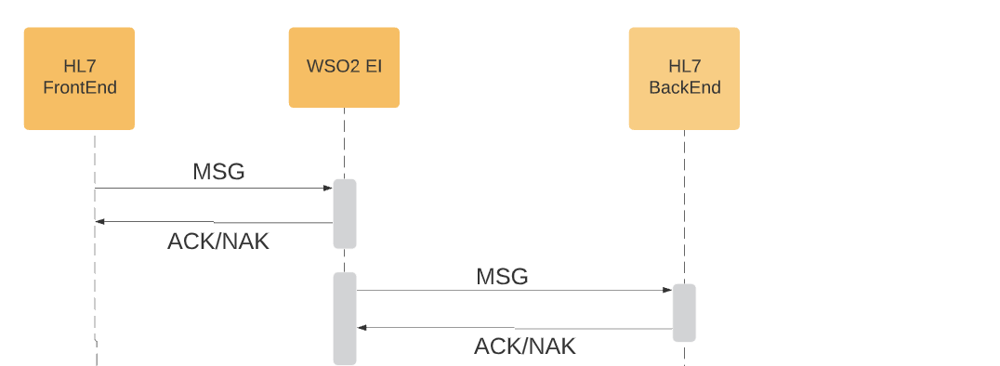

# Asynchronous delivery of HL7 messages over MLLP protocol using WSO2 Message Store and Message Processors. 

This samples demonstrates asynchronous HL7 messages delivery over MLLP protocol in an and
 implemented using WSO2 Message Store and Message Processors. Once the WSO2 EI received 
 the messages, it immediately acknowledge the frontend application and store the message
  internally to send it in a reliable manner. After the successful  delivery to the 
  backend HL7 message is removed from the internal store

NOTE: Due to a limitation of handling HL7 acknowledgement this sample use custom MessageProcessor called com.integrationworks.hl7.extension.HL7ScheduledMessageForwardingProcessor instead of  ScheduledMessageForwardingProcessor which can be found here.  

## Prerequisites

* Build and run the sample backends and integration flows as described  [here.](https://github.com/sagara-gunathunga/hl7-wso2-integration-samples/blob/master/hl7-integration-sample/README.md#how-to-build)

## How to Test

* Start HAPI TestPanel and create a new connection for port 9393 and send a sample message. 

* In case if you have used receiving connection in the HAPI TestPanel, you should able to see the received message in the 
HAPI TestPanel; otherwise, if you have used provided test backend, you should able to see received messages in the 
server console.  

 

