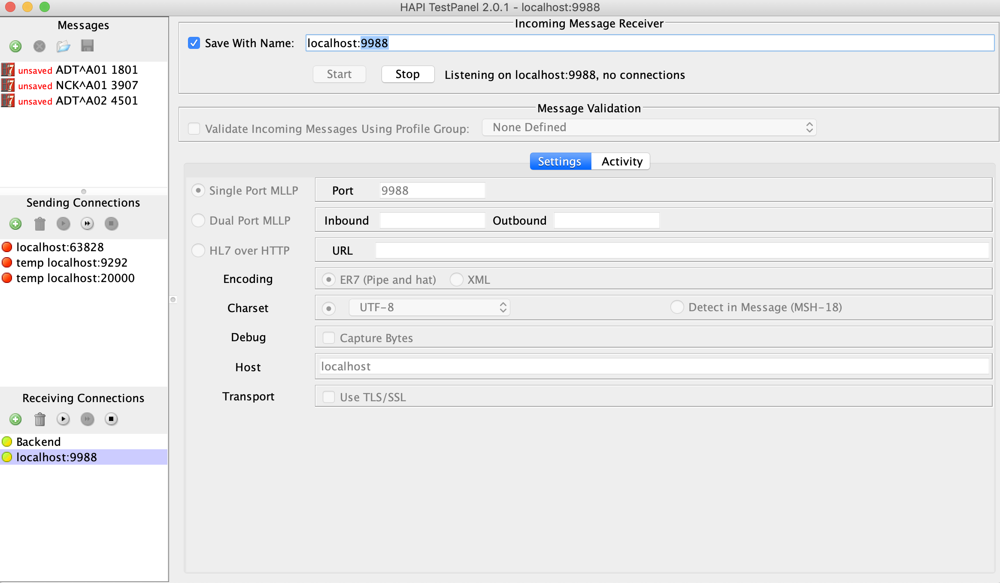

# WSO2 Micro Integrator HL7 Passthrough Samples 

These samples demonstrate the following integration scenarios related to HL7 using WSO2 Micro Integrator 7.X. 

* **Passthrough HL7-ER7 messages over MLLP protocol using a proxy service.**

* **Passthrough HL7-ER7 messages over HTTP protocol using a proxy service.** 

* **Passthrough HL7-ER7 messages over MLLP protocol using HL7 inbound endpoint.**  


## Prerequisites

* Apache Maven to build the samples. 

* Docker to run the samples.

* HAPI TestPanel to send sample messages  
(https://hapifhir.github.io/hapi-hl7v2/hapi-testpanel/)  


## How to Build

The following commands build both Java-based HL7 backend server and WSO2 Integration samples, and package them as Docker images.  


Building the sample backend
```

cd hl7-passthrough-sample/hl7backend

mvn clean install

```


Building the WSO2 EI (MI) with integration flows. 

```

cd hl7-passthrough-sample/wso2-hl7-integration

mvn clean install

```

### Setting up the HL7 test backend.  


One of the following two options can be used to setup the HL7 test backend. 


**Option A : Running the provided backend as a Docker instance.** 


```

docker run -it --rm -p 9988:9988 hl7-samples/hl7backend


```
  
  
**Option B : Set up a HL7 listener on HAPI TestPanel**  


Configure a receiving connection on HAPI TestPanel using port 9988 as shown in the following diagram.  




  
  
##  Running WSO2 Micro Integrator using Docker

Use the following docker run command

```
docker run -it --rm  -p 9292:9292 -p 8290:8290 -p 20000:20000 -e HL7_BE_URL=hl7://host.docker.internal:9988 hl7-samples/integration
```


## How to Test

Use one of the steps to test each scenario. 


